# 🛡️ NetworkWalks Week 4
## Mediroza General Hospital - Authorized Penetration Testing Assessment

**Intern:** Lubanzi Fihla  
**Batch:** B083  
**Program:** NetworkWalks Cybersecurity Internship  
**Week:** 4  
**Assessment Type:** Authorized Black-Box Penetration Test  
**Target:** `medirozahospital.com`

---

##  Engagement Overview

This repository documents my Week 4 hands-on penetration-testing project completed as part of the NetworkWalks Cybersecurity Internship.

The assessment focused on an authorized Mediroza General Hospital training environment and progressed through three technical milestones:

- 🔵 **M1 - Initial Access & Web Application Assessment**
- 🟢 **M2 - Protected PDF Security Assessment**
- 🟠 **M3 - Critical Data Exposure Analysis**
- 📑 **M4 - Professional Penetration Testing Report**

The project provided practical experience in reconnaissance, authentication analysis, protected-document assessment, metadata analysis, evidence handling, data-exposure investigation, and professional security reporting.

> ⚠️ **Authorization Notice:**  
> This project was conducted within an explicitly authorized cybersecurity training environment. Techniques demonstrated in this repository must only be used against systems for which the tester has explicit permission.

---

# 🗂️ Repository Structure

```text
NETWORKWALKS-B083-WK4-Mediroza-General-Hospital-Penetration-Test/
│
├── README.md
│
├── reports/
│
└── screenshots/
    ├── M1/
    ├── M2/
    └── M3/
```

Sensitive source artifacts such as patient reports, recovered credentials, raw database backups, national identification numbers, and other confidential records are intentionally excluded from this public repository.

---

# 🎯 Assessment Objectives

The engagement focused on:

1. Identifying the exposed application attack surface.
2. Analysing authentication behaviour.
3. Evaluating access controls around protected patient resources.
4. Assessing password protection applied to retrieved PDF reports.
5. Examining recovered artifacts and document metadata.
6. Identifying server-side confidential-data exposure.
7. Documenting findings, evidence, impact, and remediation recommendations.

---

# 🛠️ Tools & Technologies

### Reconnaissance and Web Analysis

- Kali Linux
- Firefox
- `curl`
- `ping`
- `nslookup`
- `dig`
- `robots.txt`
- `sitemap.xml`
- Gobuster
- DIRB

### PDF and Metadata Analysis

- ExifTool
- `pdfinfo`
- `qpdf`
- `pdftotext`
- `pdf2john`

### Password Security Assessment

- John the Ripper
- Hashcat
- pdfcrack
- NetworkWalks password-testing tools

### Evidence & Documentation

- SHA-256 hashing
- Git
- GitHub
- Visual Studio Code
- Markdown

---

# 🔵 Milestone 1 - Initial Access

## 🎯 Objective

M1 focused on reconnaissance, identification of exposed entry points, analysis of authentication behaviour, assessment of application input handling, and demonstration of access to the designated restricted patient-report area.

---

## 1. Target Discovery

Initial testing confirmed the target environment and DNS resolution.

### 📸 Target Reachability

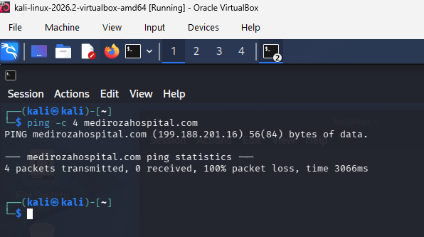

### 📸 DNS Resolution

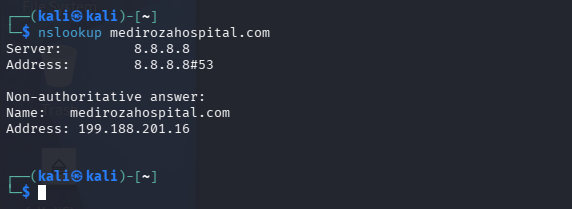

---

## 2. Public Web Reconnaissance

Manual browsing was used to understand the exposed application surface.

### 📸 Mediroza Homepage

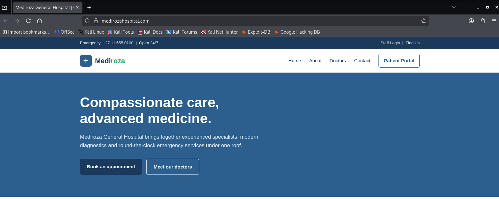

The public website exposed multiple application entry points, including patient and staff authentication interfaces.

---

## 3. Authentication Entry Points

### 📸 Patient Portal

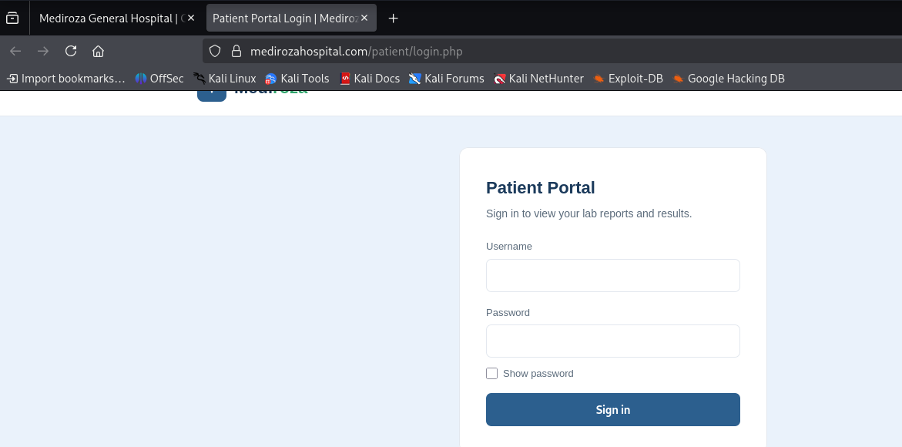

### 📸 Staff Login

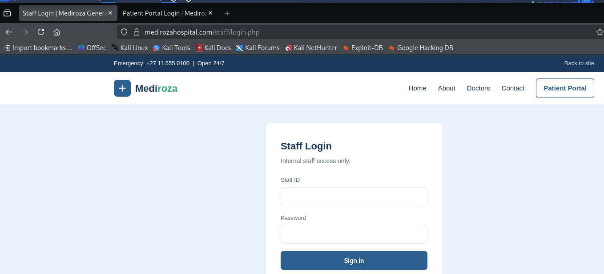

---

## 4. Authentication Information Disclosure

Testing identified differing authentication responses.

### 📸 Invalid Login Behaviour

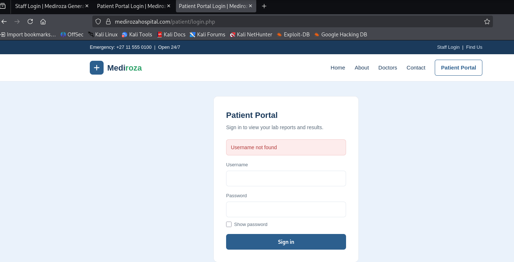

A username-specific error response was observed rather than a generic authentication failure message.

### Security Impact

Different responses may allow account enumeration by revealing whether a supplied username exists.

### Recommendation

Authentication failures should always produce a generic response such as:

```text
Invalid username or password.
```

Rate limiting, centralized authentication logging, and abnormal-login monitoring should also be implemented.

---

## 5. Additional Reconnaissance

### 📸 Doctors Page

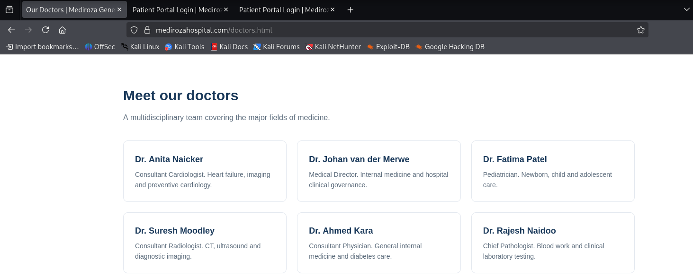

### 📸 Contact Page

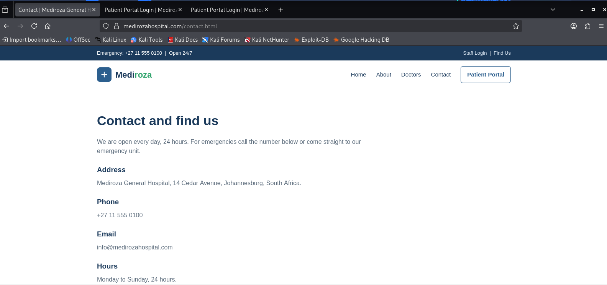

### 📸 HTTP Headers

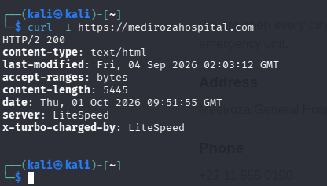

---

## 6. Public Resource Discovery

Reconnaissance of public web resources revealed additional application paths.

### 📸 robots.txt

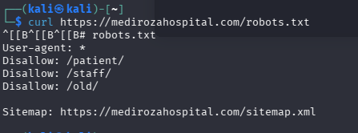

### 📸 Sitemap

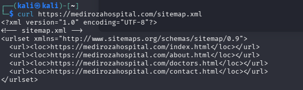

---

## 7. Legacy Resource Exposure

A legacy server location was identified during reconnaissance.

### 📸 Exposed Legacy Directory

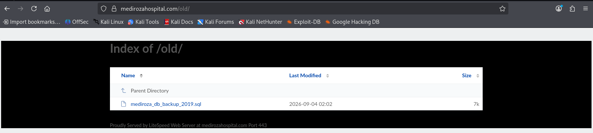

### 📸 Resource Headers

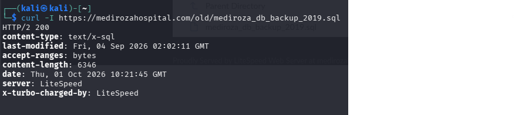

> Sensitive backup contents are deliberately not published in this repository.

---

## 8. Restricted Area Access

The authorized exercise ultimately demonstrated access to the designated restricted area associated with the patient-report workflow.

### 📸 Restricted Area Evidence

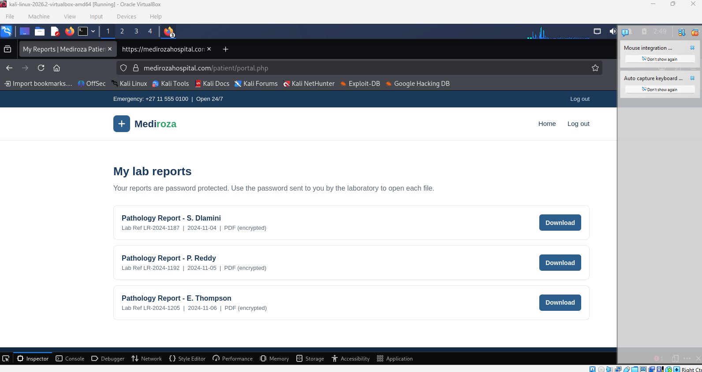

Sensitive patient information has been omitted or redacted from the public repository.

---

## ✅ M1 Outcome

Milestone 1 resulted in:

- Successful reconnaissance
- Identification of exposed application entry points
- Authentication-information disclosure identified
- Legacy resource exposure identified
- Restricted-area access demonstrated
- Three protected patient PDF reports retrieved for M2 analysis

---

# 🟢 Milestone 2 - Protected PDF Security Assessment

## 🎯 Objective

M2 assessed the encryption and password protection applied to the three patient PDF reports retrieved during M1.

The goal was to:

1. Analyse the encryption protecting each report.
2. Conduct the authorized password-recovery exercise.
3. Demonstrate successful access to all three reports.
4. Preserve evidence supporting the assessment results.

---

## 1. Encryption Verification

All three reports were confirmed to be password protected.

Analysis identified:

```text
PDF Version: 1.4
Encryption: Standard V2.3 (128-bit)
```

### 📸 Encryption Evidence

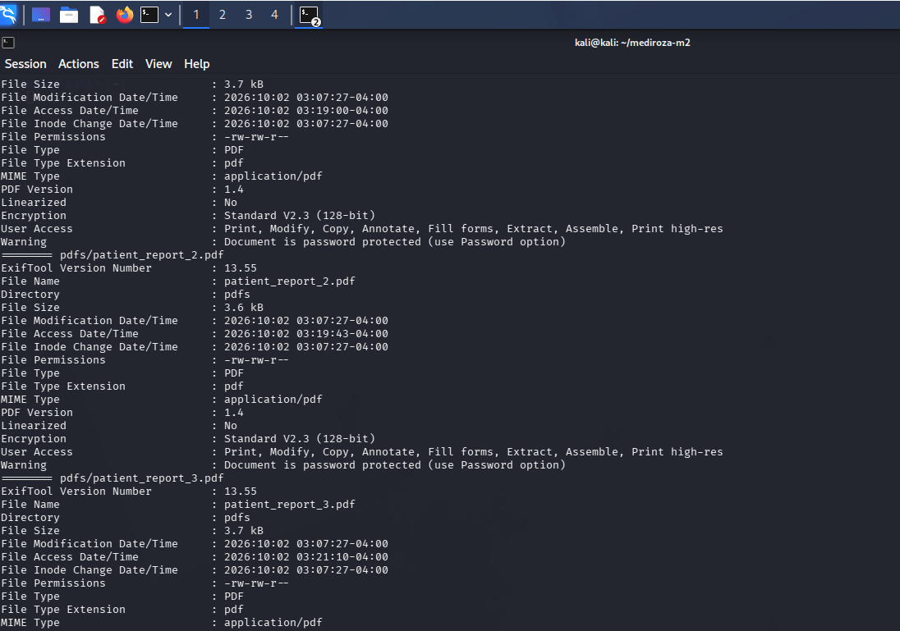

---

## 2. Password Security Assessment

The authorized M2 exercise demonstrated that the report credentials could be recovered using the approved password-testing methodology.

Recovered passwords are intentionally **not published** in this public repository.

### 📸 Password Recovery Evidence

Use the redacted versions of the recovery screenshots here.

```text
M2-02-Report1-Password-Recovered-REDACTED.png
M2-02-Report2-Password-Recovered-REDACTED.png
M2-03-Report3-Password-Recovered-REDACTED.png
```

---

## 3. Report 1 Access Verification

### 📸 Initial Denied State

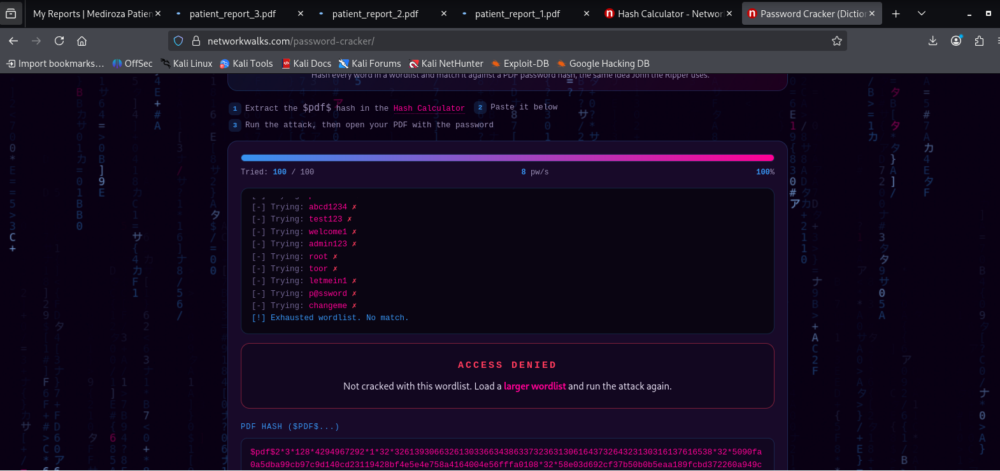

### 📸 Successful Access

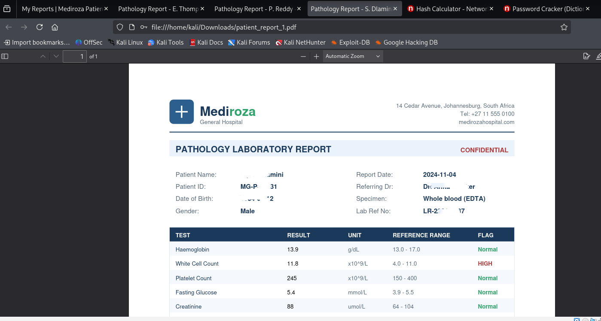

---

## 4. Report 2 Access Verification

### 📸 Successful Access

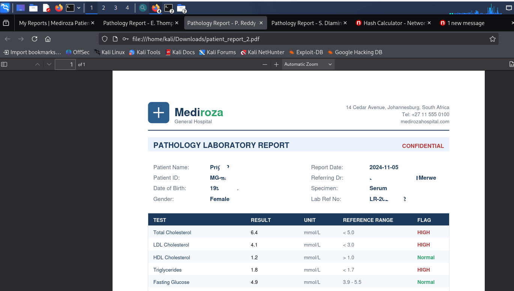

---

## 5. Report 3 Access Verification

### 📸 Successful Access

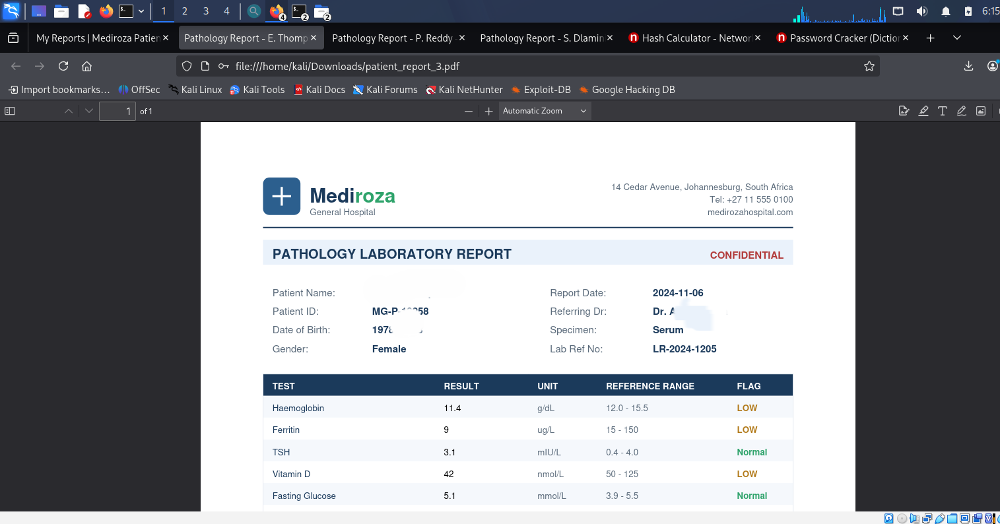

---

## 🔐 M2 Security Finding

### Weak Document Password Protection

**Severity:** 🔴 High

The protected patient reports were accessible after the authorized password-recovery exercises.

This demonstrates why PDF-level password protection should not be treated as the primary access-control mechanism for sensitive medical records.

### Security Impact

If encrypted documents are obtained by an unauthorized party, password guesses can be performed offline without additional interaction with the hospital application.

Weak credentials could therefore result in disclosure of sensitive clinical information.

### Recommendations

- Do not rely solely on PDF passwords for protecting patient records.
- Require authenticated application access before reports can be downloaded.
- Use strong randomly generated credentials where document encryption is required.
- Use modern AES-256 document encryption rather than legacy protection.
- Deliver document passwords using a separate secure communication channel.
- Implement centralized access logging and report-download monitoring.

---

## ✅ M2 Outcome

All three protected reports were:

```text
Retrieved → Encryption Analysed → Password Recovery Tested → Access Verified
```

The milestone was successfully completed with evidence retained for reporting.

---

# 🟠 Milestone 3 - Critical Data Exposure Analysis

## 🎯 Objective

M3 focused on analysing everything collected previously, including file properties and metadata, to identify a clue leading to further critical exposure.

---

## 1. PDF Metadata Analysis

Document metadata was reviewed for information that was not visible within the normal clinical report content.

### 📸 Report 1 Metadata

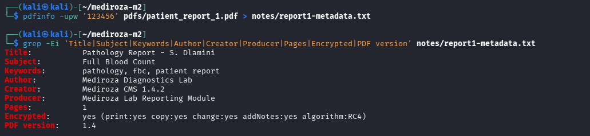

### 📸 Report 2 Metadata

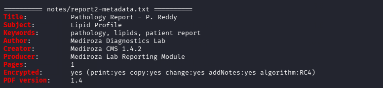

### 📸 Report 3 Metadata

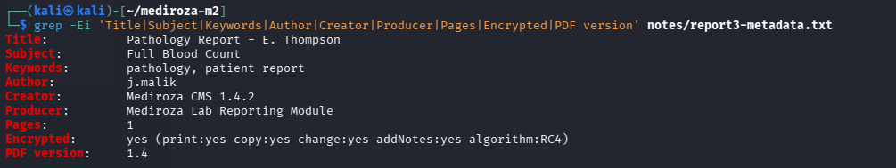

---

## 2. Metadata Comparison

Cross-document metadata analysis identified information associated with the application and document-generation environment.

### 📸 Metadata Comparison

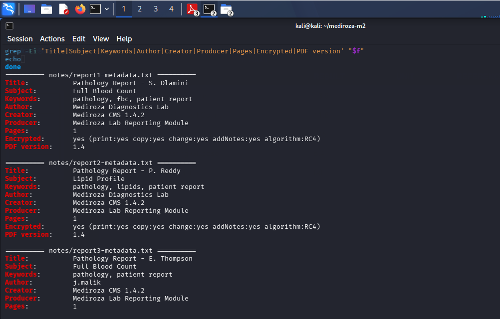

---

## 3. Custom Metadata Pivot

A custom document property provided a clue pointing toward a legacy server location.

### 📸 Metadata Pivot Evidence

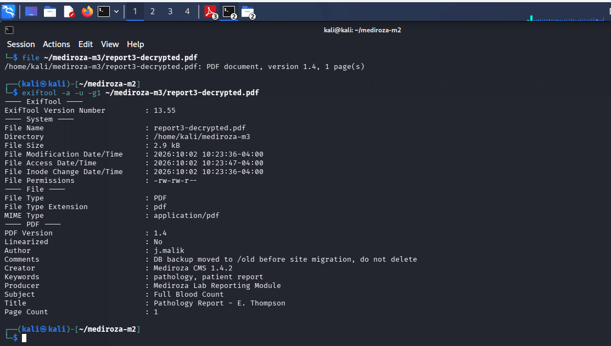

This established the evidence chain:

```text
Patient Report
      ↓
Metadata Analysis
      ↓
Custom Metadata Finding
      ↓
Legacy Resource Location
      ↓
Critical Server-Side Exposure
```

---

## 4. Exposed Database Backup

The authorized investigation identified a legacy database backup associated with the hospital environment.

### 📸 Backup Header

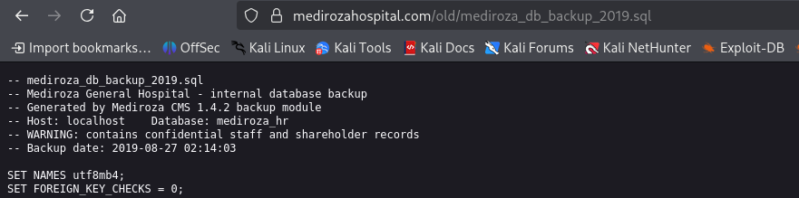

The raw database backup is intentionally excluded from this public repository.

---

## 5. Confidential HR Data Exposure

The exposed backup contained confidential employee-related information, including compensation information.

### 📸 Sanitized Salary Evidence

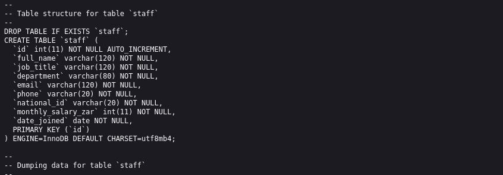

The public screenshot should redact:

- National identification numbers
- Private telephone numbers
- Personal contact information
- Other unnecessary PII

---

## 6. Shareholder Information Exposure

The same exposure contained confidential organizational ownership information.

### 📸 Sanitized Shareholder Evidence

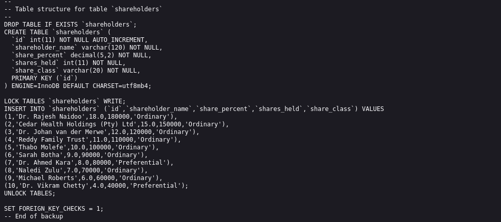

---

## ✅ M3 Outcome

The analysis successfully demonstrated a chain from recovered-document metadata to exposure of a legacy server resource containing confidential organizational information.

Sensitive raw records are intentionally excluded from the public repository.

---

# 📊 Findings Summary

| ID | Finding | Severity |
|---|---|---|
| M1-01 | Authentication information disclosure | 🟠 Medium |
| M1-02 | Restricted patient-report exposure | 🔴 High |
| M2-01 | Weak patient-report password protection | 🔴 High |
| M3-01 | Exposed legacy server directory | 🔴 Critical |
| M3-02 | Publicly exposed database backup | 🔴 Critical |
| M3-03 | Confidential employee-data exposure | 🔴 Critical |
| M3-04 | Confidential shareholder-data exposure | 🔴 Critical |

---

# 🔥 Overall Risk Assessment

**Overall Engagement Risk: CRITICAL**

The most serious issue was the exposure of a legacy database backup through a web-accessible server location.

The exposed data combined technical, employee, financial, and organizational information, significantly increasing the potential business impact.

---

# 🛡️ Recommendations & Remediation

## 1. Disable Directory Listing

Directory indexes should be disabled globally on production infrastructure.

For compatible Apache/LiteSpeed configurations:

```apache
Options -Indexes
```

---

## 2. Remove Backups from the Web Root

Files such as:

```text
.sql
.bak
.zip
.tar.gz
```

must never be stored in publicly served application directories.

Backups should be stored in dedicated restricted storage outside the web document root.

---

## 3. Strengthen Authentication Responses

Applications should return one generic response for all failed authentication attempts.

Example:

```text
Invalid username or password.
```

---

## 4. Strengthen Patient Report Access Control

Patient reports should only be served after both:

```text
Authentication
+
Authorization
```

have been validated server-side.

Document passwords should serve only as an additional control, not as the primary security boundary.

---

## 5. Improve Document Encryption

Where encrypted exports are required:

- Use AES-256 encryption.
- Generate long random passwords.
- Prohibit common passwords.
- Deliver credentials separately from the encrypted document.

---

## 6. Metadata Sanitization

Document-generation workflows should remove unnecessary internal information before reports are distributed.

This includes:

- Internal usernames
- Server paths
- Debug comments
- Backup locations
- CMS implementation information
- Information that reveals infrastructure architecture

---

## 7. Sensitive Data Governance

Confidential HR and corporate records should be:

- Access controlled
- Encrypted at rest
- Logged and monitored
- Retained only where necessary
- Regularly reviewed
- Removed securely when no longer required

---

# 🧠 Key Lessons Learned

This project strengthened my practical understanding of:

- Web reconnaissance
- DNS and HTTP analysis
- Authentication assessment
- Access-control testing
- PDF security
- Encryption analysis
- Password security
- Evidence integrity
- SHA-256 hashing
- Metadata analysis
- Information disclosure
- Directory indexing
- Sensitive-data exposure
- GitHub security documentation
- Professional penetration-test reporting

One of the most important lessons from the exercise was that a security assessment should not stop after finding the first vulnerability.

A small piece of exposed metadata can become a pivot point leading to a much larger organizational security issue.

---

# 📑 Assessment Reports

Detailed milestone reports are available in the `reports/` directory.

```text
reports/
├── Mediroza_Milestone1_Pentest_Report.docx
├── Mediroza_Milestone2_Pentest_Report.docx
├── Mediroza_Hospital_Milestone3_Report.pdf
└── Mediroza_Final_Penetration_Test_Report.pdf
```

---

# 🔐 Evidence Handling

The public portfolio intentionally excludes or redacts:

- Patient medical records
- Patient identifiers
- National identification numbers
- Recovered passwords
- Session cookies
- Authentication tokens
- Raw password hashes
- Raw database backups
- Unnecessary employee contact details

The objective of this repository is to demonstrate the **security methodology, evidence chain, findings, and remediation thinking**, not to redistribute confidential information.

---

#  Acknowledgement

A sincere thank you to **Waqas Karim (CCIE) ** and the **NetworkWalks Team** for the guidance, practical exercises, and opportunity to gain hands-on penetration-testing experience.

The Week 4 project provided valuable exposure to the complete assessment lifecycle:

```text
Reconnaissance
      ↓
Vulnerability Identification
      ↓
Controlled Validation
      ↓
Evidence Collection
      ↓
Impact Analysis
      ↓
Remediation
      ↓
Professional Reporting
```

---

# ⚠️ Ethical Use Disclaimer

This repository documents an **authorized cybersecurity assessment performed in a controlled educational environment** as part of the NetworkWalks Cybersecurity Internship.

All testing was conducted within the scope and written authorization provided for the exercise.

The techniques discussed in this repository must only be used against systems, files, networks, and environments where explicit authorization has been granted.

---


## 🔐 Lubanzi Fihla

**Network Engineer | Cybersecurity Learner**

**NetworkWalks Cybersecurity Internship - Batch B083**

*Learning by doing. Documenting every step. Building practical cybersecurity skills.*


